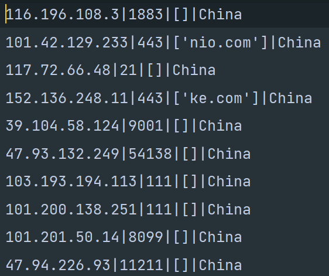
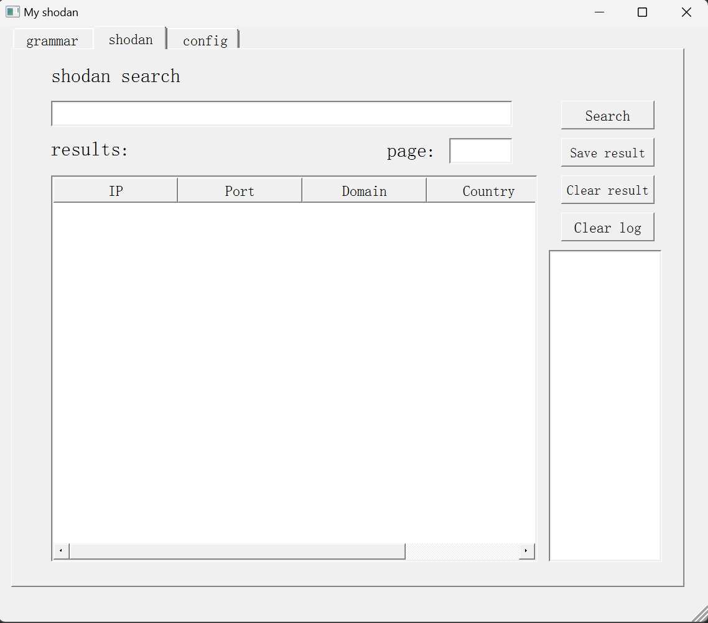
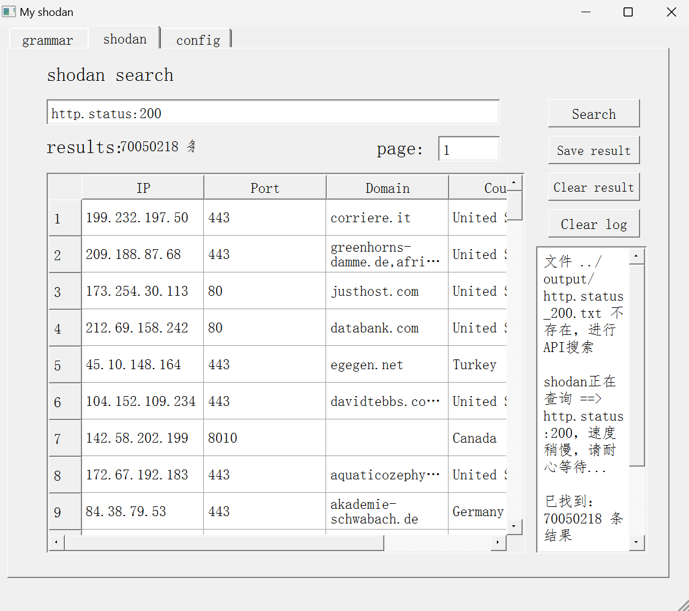

# 前言

shoPwll是一个前后端分离的网络爬虫工具，使用python3编写，具有Shodan的数据采集与分析功能。

## 项目下载

```bash
git clone https://github.com/IdealToFly/shoPwll.git
```

# 项目主要结构

### shodan_ui.py：提供前端ui交互方式

### setup.py：整个项目的中央处理器，提供后端支持和前端数据交互功能

### Gather.py：通过api接口爬虫技术进行数据库的建设

### output：项目的数据库，以txt格式保存数据

# 安装依赖：
使用 pip 命令从 requirements.txt 中安装所有列出的依赖：
``` bash
pip install -r requirements.txt
```
该命令会读取 requirements.txt 文件，并自动下载和安装文件中列出的所有依赖库及其指定版本。
如果你使用的是虚拟环境，pip 会在该环境内安装这些库。

## 使用my_gather进行数据采集

shoPwll中存在一个子项目my_gather,其功能是通过后端的Gather方法进行数据采集，可采用终端运行：
``` bash
python Gather.py
```

通过输入搜索关键词即可在shodan上爬取相关数据。

如果您是一名开发者，可以通过改变config.py中的配置信息进行更个性化的搜索。

### 数据库的建立

Gather.py会把爬取到的数据以字符串的格式输出到output目录中，以txt格式存储并通过'|'分割数据。

### 通过my_gather数据采集的样例



## 结合shodan进行数据库前后端分离查询

为使项目更加规范且具有灵活性，我们采用前后端分离的方式，并通过构建数据库对爬取信息进行统一管理。

### 通过setup方法进行数据打印与搜索

在setup方法中，我们通过一个MyWindow类封装了所有函数，实现了前后端数据库集成一体。

终端打开前端交互UI界面：
``` bash
python shodan/setup.py
```
建议下载方正清刻本悦宋简体字体进行展示，整体界面如下：



### 主要交互功能介绍

#### search：进行数据搜索

在您输入搜索关键字后，search方法会先调用本地数据库，本地数据库找不到数据后，则会进行shodan网站的数据爬取。

#### save result：将数据导入数据库

通过save result，您可以将搜索出来的结果导入到output数据库中。

#### config：进行shodan项目api的配置

#### page：通过输入的page 实现读取第1-page页的内容 

### 搜索结果样例


# 结尾

项目通过集成化管理，方便用户进行操作的同时，也支持程序员进行二次开发，相信shoPwll会成为你爬虫搜索与数据分析的利器。
